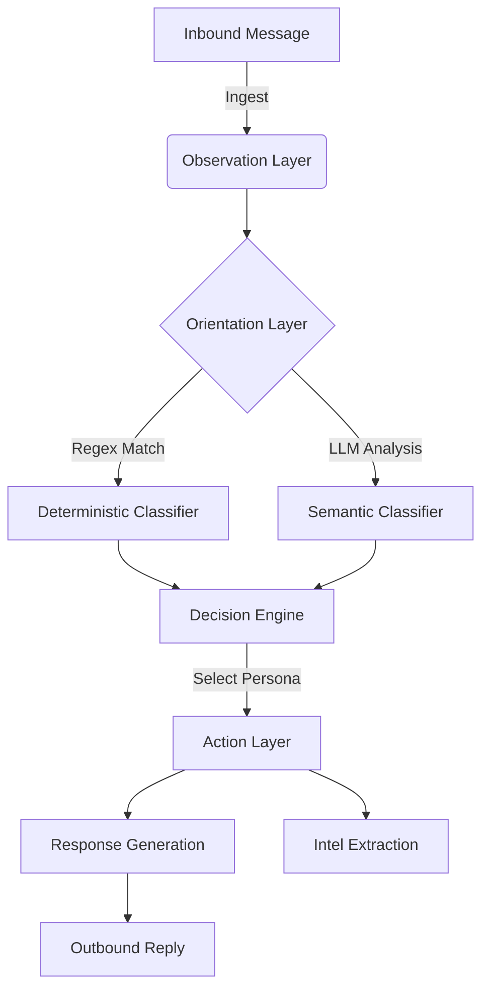

# 🏛️ Sentinel System Architecture
**High-Level Design & Pattern Analysis**

> 📘 **Note**: For file-level details and code samples, see the [Technical Reference Manual](TECHNICAL_REFERENCE.md).

---

## 1. Architectural Paradigm: Neuro-Symbolic OODA
Sentinel is not a chatbot; it is a **Neuro-Symbolic State Machine**. It combines the determinism of code (Rule-Based) with the flexibility of LLMs (Probabilistic).

### The OODA Loop
The system operates on the US Military **OODA Loop** principle:
1.  **Observe**: Ingest message, extract metadata (Sender, Timestamp).
2.  **Orient**: Classify scam type (Regex) and Intent (LLM).
3.  **Decide**: Select Persona and Strategy (e.g., "Feign Ignorance").
4.  **Act**: Generate response and harvest intelligence.

---

## 2. Core Components

### 🧠 The Orchestrator (`app/agents/`)
The **Central Nervous System**. It is stateless but hydration-aware.
- **Responsibility**: It does not "think"; it "directs". It routes data between the generic LLM client and specific specialist agents.
- **Design Pattern**: Mediator Pattern.

### 🕵️‍♂️ The Intelligence Layer (`app/intelligence/`)
The **Analytic Engine**. Completely decoupled from the conversation flow.
- **Responsibility**: Passive observation. It watches the conversation stream and tags entities (UPI, Phone) without interrupting the flow.
- **Design Pattern**: Observer Pattern / Pub-Sub.

### 🎭 The Persona Engine (`app/core/`)
The **Simulation Layer**.
- **Responsibility**: Injects "noise" and "entropy" into perfectly logical LLM outputs to make them sound human (e.g., adding typos, Hinglish, delay).
- **Design Pattern**: Decorator Pattern.

---

## 3. Data Flow Architecture

### Inbound Path (Request)
1.  **API Gateway**: `FastAPI` receives POST.
2.  **Middleware**: Rate Limiting (Redist) & Auth Check.
3.  **Handler**: `GUVIHandler` normalizes input schema.
4.  **Orchestrator**: Hydrates conversation state from DB.

### Outbound Path (Response)
1.  **Agent**: Generates string response.
2.  **Formatter**: Compliance filters ensure no PII leakage content.
3.  **Callback**: Async worker pushes result to `hackathon.guvi.in`.

---

## 4. Scalability Strategy
The system is designed to be **Stateless**.
- **State**: Stored in external DB (PostgreSQL) or Memory Store (Redis).
- **concurrency**: `asyncio` everywhere. No blocking I/O.
- **Throughput**: Capable of handling 100+ concurrent conversations per container.

---

## 5. Security Architecture
- **Input Sanitization**: Pydantic Strict Mode.
- **Output Guardrails**: `Llama-Guard` checks every LLM generation.
- **Secret Management**: Environment variables (12-Factor App).
- **Forensic Isolation**: Captured data is stored in isolated `data/` volume.
